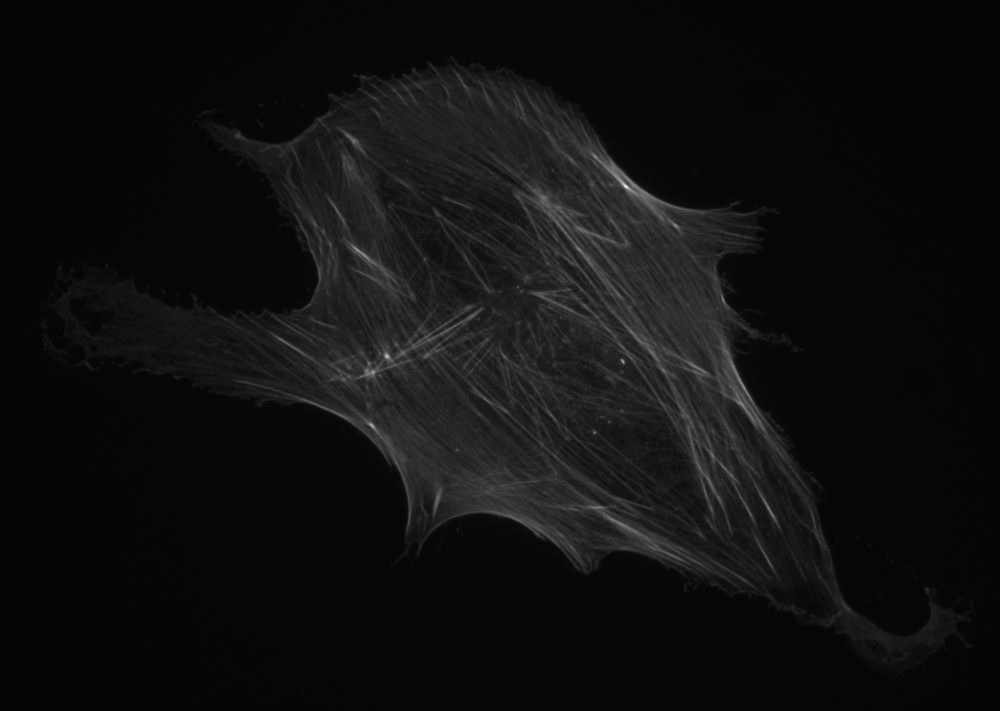

# DM I AI 2024 Cell Classification

This use case is about classifying heterogenous and homogenous human cells!



The images in this challenge are fluorescence microscope images of adult human cells collected from bone marrow. Three populations of cells were cultured for 24 hours and then imaged. Using persistent homology, each population was grouped into two subpopulations, where one is morphologically homogenous. The homogenous subpopulation is a relatively small percentage of each population. 

The challenge is to develop a framework which correctly identifies this homogeneous subpopulation. All the cells came from the same donor and were cultured and imaged in identical conditions. 
To calculate the final score, we’ll use the following values:

Let $n_0$​ be the number of cells that have the label 0.

Let $n_1$​ be the number of cells that have the label 1.

Let $a_0$​ be the number of cells that your model correctly predicted as label 0.

Let $a_1$​ be the number of cells that your model correctly predicted as label 1.

Where label 0 is heterogenous and 1 is homogenous.
The score is then calculated using this formula:

$$
\text{Score} = \frac{a_0 * a_1}{n_0 * n_1}
 $$

## Data Description

Each image is a `.tif` file with greyscale image data of varying sizes. The datasets are split into 3 for the challenge:

* 139 training images
* 131 validation images
* 117 evaluation images

The training images can be found in /data/training with the corresponding labels. Note that the naming of the images does not include even numbers. Neither does the validation and evaluation datasets. Heterogenous cells have label 0 and homogenous cells have label 1.

The training images are 16 bit, and the validation and evaluation images you recieve are 8 bit. 

## Evaluation
During the week of the competition, you will be able to validate your solution against the validation set. You can do this multiple times, however, **you can only submit to the evaluation set once!** The best validation and evaluation score your model achieves will be displayed on the <a href="https://cases.dmiai.dk"> scoreboard</a> . 
**We encourage you to validate your code and API before you submit your final model to evaluation.**

When validating and evaluating, you will have 10 seconds per picture, before the server will time out the connection. Hence your model needs to be able to give a prediction within 10 seconds. 

###  Scoring
The score is calculated by comparing the correctly predicted cells (a0 and a1) to the total number of labeled cells (n0 and n1). The formula is:

$$
\text{Score} = \frac{a_0 * a_1}{n_0 * n_1}
 $$
 
This formula calculates the accuracy of your model’s predictions for both labels. It measures how well your model balances correctly identifying both heterogeneous (label 0) and homogeneous (label 1) cells, relative to the total number of cells labeled as 0 and 1. This means if it fails to correctly label any of one type of cell, the score will be 0. Therefore, it's important for your model to perform well on both labels.

## Quickstart
Clone the repository and change folder to the ct-inpainting challenge

```cmd
git clone https://github.com/amboltio/DM-i-AI-2024
cd DM-i-AI-2024/cell-classification
```
Install dependencies
```cmd
pip install -r requirements.txt
```

### Serve your endpoint
Serve your endpoint locally and test that everything starts without errors

```cmd
python api.py
```
Open a browser and navigate to http://localhost:4321. You should see a message stating that the endpoint is running. 
Feel free to change the `HOST` and `PORT` settings in `api.py`. 

### Make your endpoint visible to the evaluation service
There are multiple options:
- **Local deployment** Ensure that the selected `PORT` on your network is open and redirecting traffic to your machine (this may not be possible depending on your network setup. Usually this involves changing settings in the admin panel of your router). 
- **Cloud deployment** Create a compute instance on Microsoft Azure, Google Cloud, Amazon Web Services (AWS) or other cloud providers. Repeat the steps above on the compute instance. 


Max 10 sekunder per billede, time out per billede, max tid 10 x mængde billeder