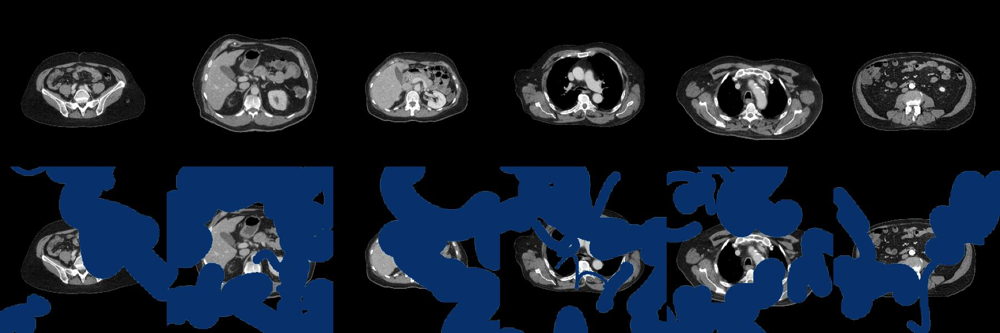
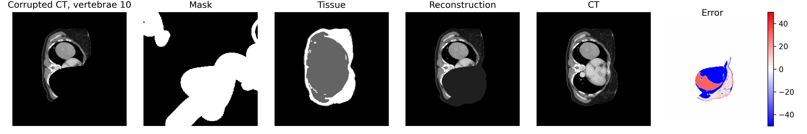
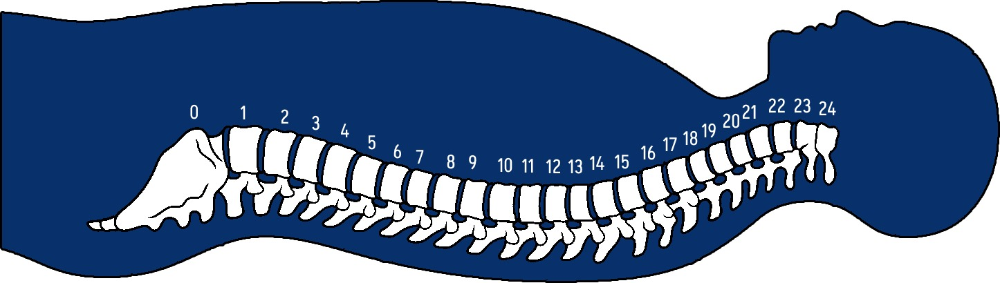

# CT Inpainting

<!-- <p align="center">
  
</p> -->


In this use case, your task is to repair medical images that have been corrupted!

You will receive so-called "CT slices" which are 2D cross-sectional anatomical images of patients. A CT slice is obtained by selecting one row of a full 3D CT volume. The images have been corrupted by randomly generated masks. Your job is inpaint the masked regions and thus recover the original CT image. In addition to the corrupted CT image, you will also receive:
- **mask**: The corruption mask used for inpainting
- **tissue**: An image showing the tissue type; white: torso fat, gray: remaining body. The tissue image is not corrupted
- **vertebrae**: An integer representing the vertical position of the CT-slice (i.e. whether the slice shows the stomach region or lung region). The integer value represents the closest vertebrae.




The dataset (```data/```) comprises 10 axial CT slices for 590 unique patients (5900 total samples).
Your reconstruction will be scored by the Mean Absolute Error (MAE) between reconstructed and true CT images:

$$
MAE = \frac{1}{N}\sum_{i=0}^N \left | y_i - \hat y_i\right |
$$

The validation set and the test set contain 166 and 182 CT slices from unique patients, respectively. 
All images are gray-scale with a width and height of 256. **You have 10 seconds to return your predictions for each image.**


## Evaluation
During the week of the competition, you will be able to validate your solution against the validation set. You can do this multiple times, however, **you can only submit to the evaluation set once!** The best validation and evaluation score your model achieves will be displayed on the <a href="https://cases.dmiai.dk"> scoreboard</a> . We encourage you to validate your code and API before you submit your final model to evaluation. 

###  Scoring
A scaled score between 0 and 1 is calculated by linearly scaling your MAE score between a baseline score, $MAE_{baseline}$, and the best MAE score among all teams, $MAE_{best}$:

$$
Score : \max \left(0,\frac{MAE_{baseline}-MAE}{MAE_{baseline}-MAE_{best}}\right)
$$

For this challenge, $MAE_{baseline}=6$. This corresponds to the approximate MAE-score achieved by running the baseline model provided in ```model.py```. This scaling means that you will get a scaled score of $0$ if you do worse than or as good as the baseline model, and a score of $1$ if you have the best model among all teams. 

## Quickstart
Clone the repository and change folder to the ct-inpainting challenge

```cmd
git clone https://github.com/amboltio/DM-i-AI-2024
cd DM-i-AI-2024/ct-inpainting
```
Install dependencies
```cmd
pip install -r requirements.txt
```
Make a local inpainting prediction of a sample from the training data using a simple baseline model
```cmd
python example.py
```
### Serve your endpoint
Serve your endpoint locally and test that everything starts without errors

```cmd
python api.py
```
Open a browser and navigate to http://localhost:9050. You should see a message stating that the endpoint is running. 
Feel free to change the `HOST` and `PORT` settings in `api.py`. 

### Make your endpoint visible to the evaluation service
There are multiple options:
- **Local deployment** Ensure that the selected `PORT` on your network is open and redirecting traffic to your machine (this may not be possible depending on your network setup. Usually this involves changing settings in the admin panel of your router). 
- **Cloud deployment** Create a compute instance on Microsoft Azure, Google Cloud, Amazon Web Services (AWS) or other cloud providers. Repeat the steps above on the compute instance. 


## About the data
The CT images have been generated based onthe AutoPET challenge dataset. It is prohibited for you to try and acquire this dataset or utilize models that have been pretrained on the dataset. 

As a sidenote, it is not easy to acquire the dataset, as one needs to first submit a request, sign a contract, and obtain legal approval from the data distributor. 

The CT images have been resampled to 2mm isotropic grid size and cropped to 256x256xZ (where Z denotes the image height). 2D images were acquired by clamping the Hounsefield Units (HU) to the interval [-150, 250], applying a gray-scale colormap, and sampling axial slices without replacement between the bottom and top vertebrae. 
