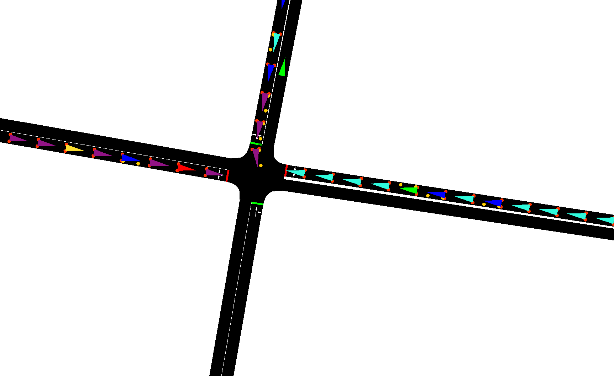
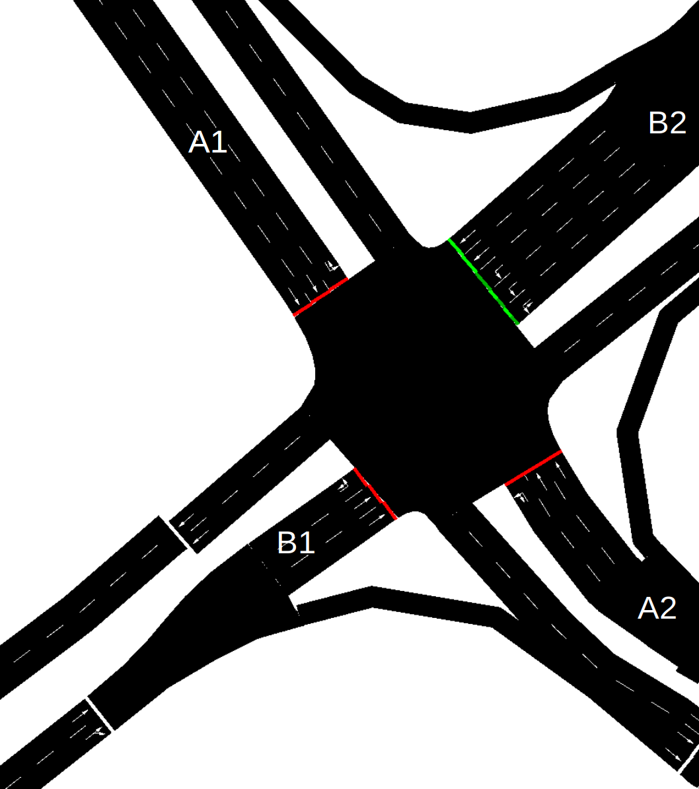

# Traffic Simulation
In this use-case the objective is to control the traffic lights at a congested intersection. 
Your job is to get as many vehicles through the intersection, thus minimizing the time waiting at the stop lights.

<p align="center">
  
</p>

The simulation runs in real time at our server. Every second, we ask you to set the state of the traffic lights. In return, you will get a list of vehicles either approaching the intersection or waiting at your red lights.

## About the game
The simulation is based on the [SUMO framework](https://eclipse.dev/sumo/) (Simulation of Urban MObility).

Each evaluation and validation runs in real time for ten minutes. The observable state of the intersection is updated every second and is sent to your REST API for instructions on the future signal state. Once received, we will use your signal commands for the *next* update of the simulation (e.g. max 1 second after).

Thus, your API service needs to provide a response within 1 second but there is no reason to chase single-digit millisecond response times; we only update the state of the traffic lights every second.

### Intersection legs
Each intersection has 3 to 4 legs where vehicles approach and leave the intersection. 
Each leg may have one or more lanes. Each of these lanes is controlled by a traffic light - and it is up to you(r algorithm) to control the traffic light.

Intersection with designated legs (Figure 2):
<p align="center">
  
</p>

A lane allows for a vehicle to cross the intersection in a certain manner. You may experience the following lane types in this use case:
- **Right**: Allows for traffic to only turn right at the lane.
- **Left**: Allows for traffic to only turn left at the lane.
- **Main**: Allows for traffic to go straight, and potentially also turn left or right, if these turns aren’t assigned to other lanes on that leg.

(*Note: Not all directions are always available.*)

In the models that you will receive, no intersection can have more than five legs.

#### Examples (refer to Figure 2)

**Lanes for Leg B2**
- **3 x Left**: Allows for left turns only
- **2 x Main**: Allows for straight traffic only
(*Right-turn lane appears before the intersection.*)

Total number of lanes for leg B2: 5

**Lanes for Leg A1**
- **1 x Left**: Allows for left turns only
- **2 x Main**: Allows for straight traffic only

Total number of lanes for leg A1: 3

**Lanes for Leg X3 (not in Figure 2)**
- **1 x Right**: Allows for right turns only
- **1 x Main**: Allows for traffic straight and left

Total number of lanes for leg X3: 2

### Vehicles
We observe the vehicles as they approach the intersection. You will receive a list of all approaching vehicles that are within 100 meters of the intersection with the following attributes:

- Distance_to_stop (m) (Distance to the traffic light)
- Speed (m/s)
- Leg (Name of the intersection leg that the vehicle is traveling on)

We do not care about the vehicles leaving the intersection. Thus, if a vehicle crosses the traffic light, it disappears. 

### Traffic lights 🚦

The observable states of the traffic lights are:

| Red   | Redamber      | Amber | Green    |
|-------|---------------|--------|----------|
| 🔴    | 🔴            | ⚫     | ⚫       |
| ⚫    | 🟡            | 🟡     |⚫        |
| ⚫    | ⚫            | ⚫     |🟢        |

We impose the following restrictions on the signals:

1. The signal cannot change directly from red to green and vice versa. The transitions are:

    a) Red -> Redamber -> Green

    b) Green -> Amber -> Red
2. Each signal state must be activated for at least:

    a) Redamber: 2 seconds
    b) Amber: 4 seconds
    c) Green: 6 seconds

3. Our simulation controller will make sure that these restrictions are enforced. Thus, if you ask to switch the signal from red to green, we will make sure that the signal goes through the redamber phase for two seconds before switching to green.

4. According to 3), it is only necessary for your model to ask for either red light or green light.

#### Signal groups
The traffic lights are controlled via signal groups. You receive a list of all the signal groups of the intersection (*signal_groups* in the DTO) and a list of signal groups per leg (*legs* in the DTO). 

The signal groups are named according to the following conventions:
- **LegNameRightTurn**: Controls the right turning lanes
- **LegNameLeftTurn**: Controls the left turning lanes
- **LegName**: Controls the main lanes

#### Examples as seen in Figure 2
**Leg B2**
- Lanes:
  - 3 x Left lanes
  - 2 x Main lanes
- Signal groups:
  - **A1LeftTurn**: Controls all the left-turning lanes
  - **A1**: Controls both of the straight lanes

**Leg A1**
- Lanes: 
  - 1 x Left lanes
  - 2 x Main lanes
- Signal groups:
  - **A2LeftTurn**: Controls the left lane
  - **A2**: Controls both of the main lanes

In the example for leg A1, if you set the signal group A1 to green, the signals for both lanes are switched to green.

There might be cases where only allowing for right-turning traffic is feasible, for instance in combinations with other left-turning or right-turning groups.


#### Allowed green light combinations
It *is* possible (but probably not desirable) to set the state to green for all of the signal groups. In the intersection above, we would not want to turn on the green lights for both leg A1 and B1 - the cars would potentially collide, and the cars behind would form a looong queue (hello exponential penalty!). 
Look in the DTO for *allowed_green_signal_combinations* - this gives you guidance on which green lights go together.


### Scoring
You will receive a score based on the total waiting time at the stop lights.
We compute the score based on the following:

**Total score**

$$
\text{score} = \sum_{i=1}^N Q_i + \sum_{i=1}^N \text{max}(0, (90-Q_i)^{1.5})
$$

where $Q_i$ is the total waiting time in seconds for vehicle *i* and $N$ is the number if vehicles in the simulation. 

We impose a penalty for every car that has waited more than 90 seconds in total. No one wants to wait forever!

**Final score** 

The final score that you see in the leaderboard is normalized in the interval between 0 to 1 by:

$$
\text{final score} = \frac{1}{\text{score}}
$$

## Interaction
Every second of the simulation, you will receive a payload containing the following:

- **vehicles** List[VehicleDto]: A list of vehicles approaching the intersection
- **total_score** float: The total score (so far)
- **simulation_ticks** int: The current simulation tick
- **signals** List[SignalDto]: The current state of the signals
- **signal_groups**: List[str]: A list of all the signal groups (e.g. signals) at the intersection
- **legs**: List[LegDto]: The names of the legs of the intersection, with a list of all the lanes and signal groups that belong to the leg.
- **allowed_green_signal_combinations**: List[AllowedGreenSignalCombinationDto]: A list for each signal group, denoting the *other* signal groups that may go into green states together with the first. 

## Evaluation
During the week of the competition, you will be able to validate your solution against the validation set. You can do this multiple times, however, **you can only submit to the evaluation set once!** The best validation and evaluation score your model achieves will be displayed on the <a href="https://cases.dmiai.dk"> scoreboard</a> . We encourage you to validate your code and API before you submit your final model to evaluation. 

Randomness: We use a random seed for running the validation endpoint. Thus, you will probably receive different scores even if your algorithm stays the same. This is to remind you to not overfit to the validation set. The random seed is fixed for the evaluation endpoint.

## Quickstart

```cmd
git clone https://github.com/amboltio/DM-i-AI-2024
cd DM-i-AI-2024/traffic-simulation
```

Install sumo according to the <a href="https://sumo.dlr.de/docs/Installing/index.html">instructions</a>.

Install dependencies
```cmd
pip install -r requirements.txt
```


### Serve your endpoint
Serve your endpoint locally and test that everything starts without errors

```cmd
python api.py
```
Open a browser and navigate to http://localhost:9051. You should see a message stating that the endpoint is running. 
Feel free to change the `HOST` and `PORT` settings in `api.py`. 

You can request the following signal states in the response:

* "red"
* "redamber"
* "amber"
* "green"

Tip: Only request the "green" and "red" states, our endpoint will take care of the rest.


### Run the simulation locally
```cmd
cd DM-i-AI-2024/traffic-simulation/sim
python3 run_sim.py
```
